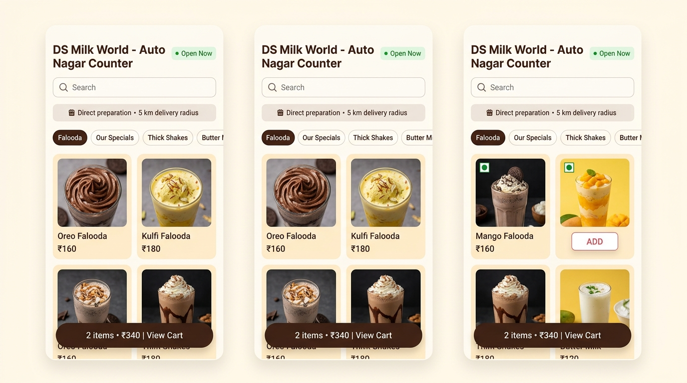
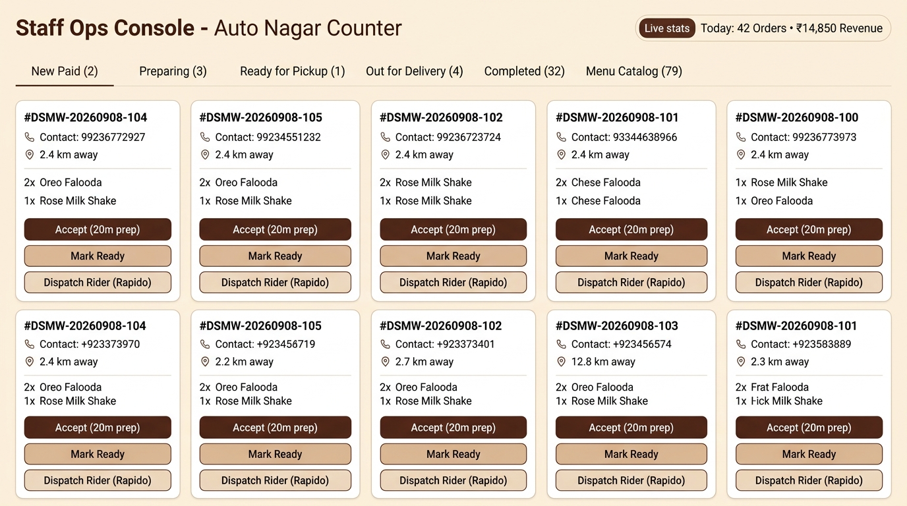
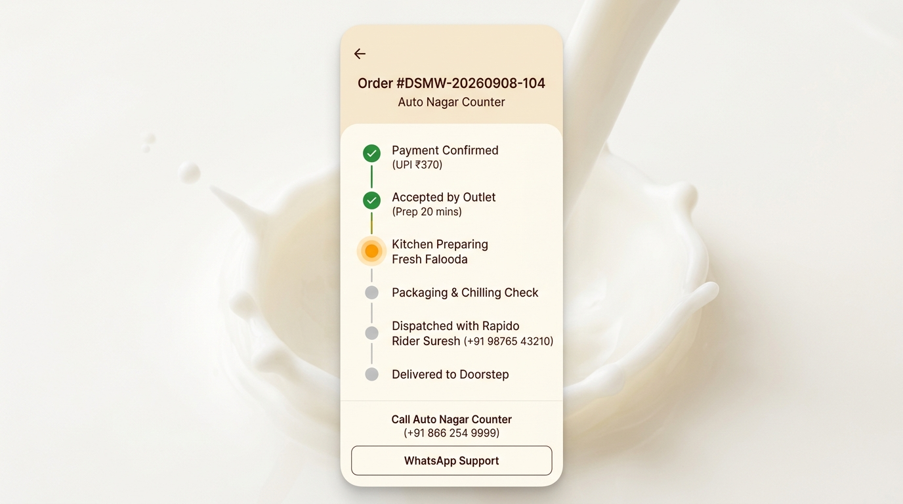

# DS Milk World — Direct-Ordering MVP Platform

> Production-ready, direct-ordering customer storefront and staff operations console for **DS Milk World** (single pilot outlet, Auto Nagar, Bandar Road, Vijayawada, Andhra Pradesh, India).

Built strictly according to the architecture, PRD, TRD, UX, and operational guidelines in the `docs/` specification package.

---

## 🥛 Architecture & Technology Stack

The platform is designed as an **All-Dart Fullstack System**:

```text
┌─────────────────────────────────────────────────────────────────────────────┐
│                          DS Milk World Platform                             │
├──────────────────────────────────────┬──────────────────────────────────────┤
│      Customer Storefront             │       Staff Operations Console       │
│  - Warm Dairy Palette & Typography   │  - Live Kanban Queue                 │
│  - 79 Menu Items across 8 Categories │  - Accept / Prep Time Selection      │
│  - Sweetness & Toppings Sheet        │  - Packaging / Chilling Checklist    │
│  - 5 km Haversine Radius & Dynamic   │  - Rapido / Aggregator / Manual      │
│    Fee Engine (₹30 base + ₹10/km)    │    Delivery Dispatch Fallback Form   │
│  - Generic Payment Gateway Simulator │  - Rejection & Auto-Refund Engine    │
│    (UPI QR/VPA, Cards, NetBanking)   │  - Catalog Stock / Availability      │
│  - Live Vertical Order Timeline      │    Toggle Switch                     │
├──────────────────────────────────────┴──────────────────────────────────────┤
│               ds_milk_world_client (Generated Dart SDK)                     │
├─────────────────────────────────────────────────────────────────────────────┤
│               ds_milk_world_server (Serverpod 2.9.5 / 3.x)                  │
│  - Endpoints: Catalog, Quote, Order, Checkout, Webhook, Admin               │
│  - Strict Server-Side Pricing Invariants (Client totals never trusted)      │
│  - Haversine Distance & Out-of-Radius Rejection                             │
│  - Webhook Idempotency Guardrail                                            │
│  - State Machine & Audit Event Logs                                         │
└─────────────────────────────────────────────────────────────────────────────┘
```

### Module Directory Structure

- **`ds_milk_world_server/`**: Serverpod backend server with typed Dart models, endpoints, business logic, geo-validation, and event auditing.
- **`ds_milk_world_client/`**: Auto-generated client library providing end-to-end type safety between backend and frontend.
- **`ds_milk_world_flutter/`**: Cross-platform Flutter application for Web, Android, iOS, Windows, macOS, and Linux.
- **`docs/`**: Complete system specification suite (`PRD.md`, `TRD.md`, `UX-AND-DESIGN.md`, `IMPLEMENTATION-PLAN.md`, `DECISIONS-AND-RISKS.md`, `ds_milk_world_menu_clean.csv`).

---

## 🎨 Visual Identity & Design System

Strictly aligned with `docs/UX-AND-DESIGN.md` and `taste-skill`:
- **Milk (`#FFF9F0`)**: Warm dairy background
- **Cocoa (`#3A241B`)**: Primary text, headings, and high-contrast buttons
- **Cream (`#FFF1D6`)**: Surfaces, badges, containers
- **Rose (`#D86773`)**: Falooda and dessert accents
- **Saffron (`#E8A23A`)**: Primary interactive highlights and action buttons
- **Mint (`#72B7A1`)**: Freshness, success, and open-store status
- **Ink (`#1E1B19`)**: High-contrast labels
- **Error (`#B63A3A`)**: Destructive and rejection alerts

### UI Previews & Showcase

| Customer Storefront | Staff Operations Console |
| :---: | :---: |
|  |  |

| Live Vertical Order Tracking |
| :---: |
|  |

---

## 📖 Installation & Deployment Guide

For full step-by-step instructions (Docker 1-click install, bare-metal local dev, database migrations, and ports), please read [INSTALLATION.md](INSTALLATION.md).

---

## 🚀 Quick Start

### Prerequisites
- **Flutter SDK**: `>= 3.24.0` (Included at `E:\flutter\bin`)
- **Dart SDK**: `>= 3.5.0`
- **Serverpod CLI**: `2.9.5` (Installed in Pub Cache)

Ensure Flutter and Serverpod CLI are on your path:
```powershell
$env:PATH = "E:\flutter\bin;$env:USERPROFILE\AppData\Local\Pub\Cache\bin;" + $env:PATH
```

---

### Running the Backend Server

```powershell
cd ds_milk_world/ds_milk_world_server
dart run bin/main.dart
```

### Running the Flutter Client (Web / Desktop / Mobile)

```powershell
cd ds_milk_world/ds_milk_world_flutter

# Run on Chrome / Web browser
flutter run -d chrome

# Or build release web bundle
flutter build web --release
```

---

## 🧪 Testing & Verification

### 1. Server Lifecycle, Pricing Invariants & Geo Tests
Runs unit tests for Haversine distance, out-of-radius rejection, 79 catalog products, pricing calculation on server, checkout creation, webhook idempotency, and staff state transitions:
```powershell
cd ds_milk_world/ds_milk_world_server
dart test test/order_lifecycle_test.dart
```

### 2. Flutter Cart & Storefront Widget Tests
Runs widget and state tests verifying UI rendering, category rails, product adding, and reactive cart updating:
```powershell
cd ds_milk_world/ds_milk_world_flutter
flutter test test/app_test.dart
```

### 3. Static Analysis
Verify zero lint warnings and zero errors:
```powershell
cd ds_milk_world/ds_milk_world_flutter
flutter analyze
```

---

## 🛡️ Business Invariants & Guardrails

1. **Server-Side Pricing**: Client-supplied prices and totals are completely ignored. Subtotal is recalculated on the server using the official catalog price snapshot.
2. **Geo-Fencing**: Orders are strictly restricted to a 5.0 km radius around Auto Nagar (`16.4950° N, 80.6650° E`). Any out-of-range order is rejected with an informative error.
3. **Delivery Fee Calculation**: Dynamic fee formula: Base ₹30 (3000 paise) up to 2.0 km, + ₹10/km (1000 paise/km) thereafter.
4. **Idempotent Webhooks**: Repeated delivery of identical payment webhook notifications will not trigger duplicate fulfillment workflows.
5. **Shop Rejection Guarantee**: If the shop rejects an order due to kitchen capacity or ingredient exhaustion, an automated refund record is generated immediately.
6. **Customer Self-Cancellation with Auto-Refund**: Customers can self-cancel before kitchen prep begins (`paid` state), triggering an instant 100% refund to the source. Once in `preparing`, cancellations are disabled to prevent perishable food waste.
7. **Staff Real-time Catalog & Price Control**: Staff console allows instant toggling of item stock availability, promotional offer pricing, and description updates synchronized across store displays.